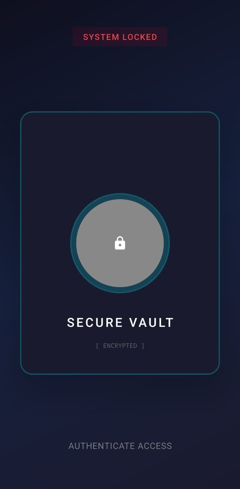
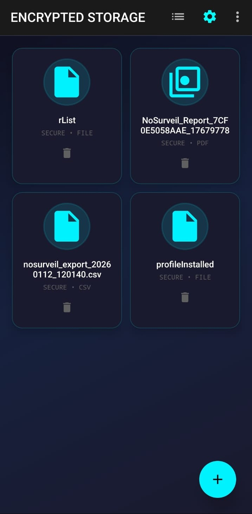
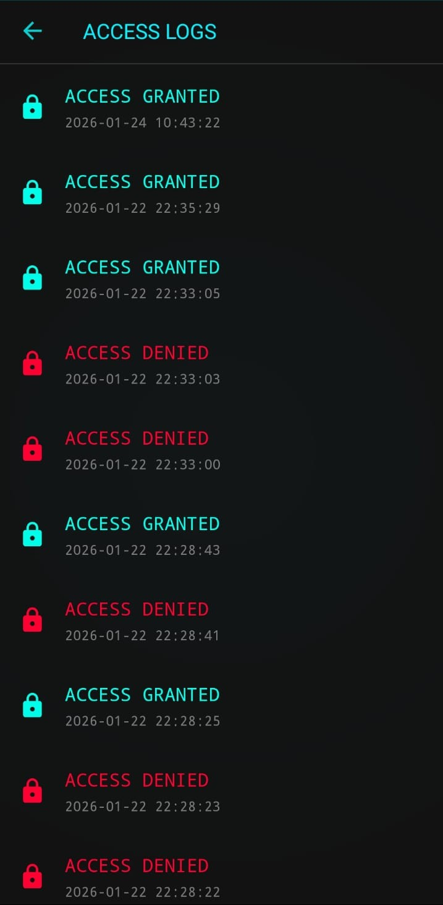

# 🔐 TiltLock

> **Reimagining Pattern Locks with Invisible Motion Gestures.**

**TiltLock** is a privacy-focused security application that abandons traditional PINs and touch patterns in favor of **gyroscope-based tilt gestures**. By rotating your device in a custom secret sequence (e.g., *Left -> Right -> Forward*), you unlock a secure vault for your most sensitive files and photos.


## 🚀 Key Features

### 🌪️ Motion-Based Authentication
- **Invisible Patterns**: Unlock your phone without touching the screen in a way that shoulder surfers can track.
- **Custom Sequences**: Record your own unique tilt combinations.
- **Adaptive Sensitivity**: Configurable sensor thresholds to distinguish between natural movement and intentional gestures.

### 🛡️ Secure Vault
- **AES-256 Encryption**: Files are encrypted using the **Android Keystore System** (AES/GCM/NoPadding).
- **On-the-fly Decryption**: Stream media directly from the vault without permanently decrypting files to storage.
- **Stealth Folder**: Hide photos, videos, and documents away from gallery apps.

### 👁️ Break-In Monitor
- **Intruder Logging**: Tracks every failed unlock attempt.
- **Timeline View**: View a history of when and how many times someone tried to access your vault.
- **Glitch Feedback**: Failed attempts trigger a "Cyber-Noir" glitch animation and haptic feedback to deter intruders.

### 🎨 Cyber-Noir Aesthetic
- **Immersive UI**: Features a dark, high-contrast design with neon accents.
- **Parallax Effects**: UI elements shift and rotate in real-time based on device orientation.
- **Haptic Feedback**: Rich tactile responses for every tick, lock, and unlock event.

---

## 🛠️ Technical Stack

- **Language**: [Kotlin](https://kotlinlang.org/)
- **Architecture**: MVVM (Model-View-ViewModel)
- **Sensors**: `android.hardware.SensorManager` (Gyroscope filtering & State Machine)
- **Security**: `javax.crypto` meets `AndroidKeyStore`
- **Persistence**: `SharedPreferences` + `Gson` (Lightweight JSON logging)
- **Concurrency**: Kotlin Coroutines & LiveData

---

## 📸 Screenshots

| Lock Screen | Secure Vault | Break-In Log |
|:-----------:|:------------:|:------------:|
|  |  |  |

---

## 📥 Getting Started

### Prerequisites
- Android Studio Iguana or newer
- KeyStore suitable for signing (debug key provided)
- Physical Device (Emulators may struggle with Gyroscope simulation)

### Installation
1. **Clone the repository**
   ```bash
   git clone https://github.com/DhruvAthaide/TiltLock.git
   ```
2. **Open in Android Studio**
   - File -> Open -> Select `TiltLock/build.gradle.kts`
3. **Build & Run**
   - Connect your physical Android device.
   - Run the `app` configuration.

---

## 🤝 Contributing

Contributions are welcome! Please fork the repository and submit a pull request for any features, bug fixes, or enhancements.

1. Fork the Project
2. Create your Feature Branch (`git checkout -b feature/AmazingFeature`)
3. Commit your Changes (`git commit -m 'Add some AmazingFeature'`)
4. Push to the Branch (`git push origin feature/AmazingFeature`)
5. Open a Pull Request

## 📄 License

Distributed under the MIT License. See `LICENSE` for more information.

---
*Built with ❤️ by [Dhruv Athaide](https://github.com/DhruvAthaide)*
